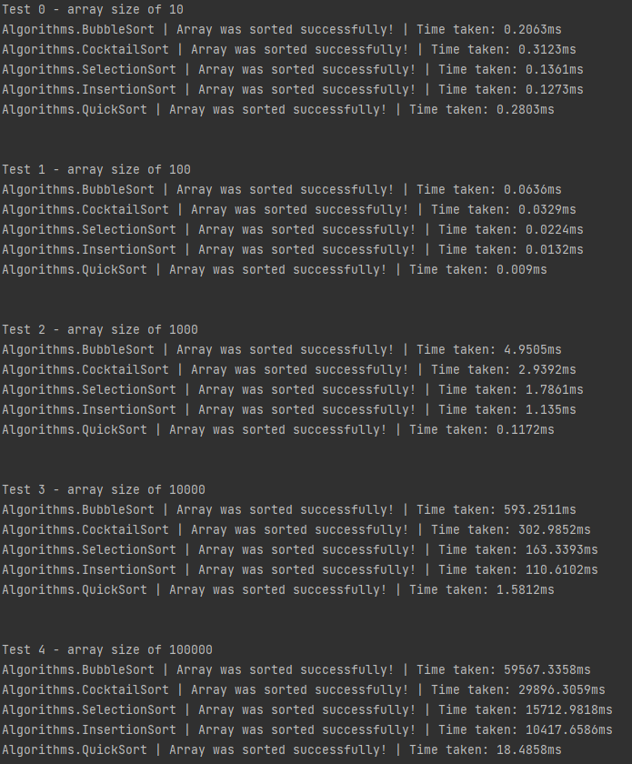

# Sorting Algorithms Comparison
A C# project that compares various sorting algorithms over a range of array sizes. 

### Currently Implemented Algorithms
The project currently implements, or intends to implement in the future:
- [X] Bubble Sort
- [X] Insertion Sort
- [X] Selection Sort
- [X] Cocktail Sort
- [X] Quick Sort
- [ ] Merge Sort
- [ ] Comb Sort
- [ ] Bucket Sort
- [ ] Heap Sort
- [ ] Shell Sort

### How to Use
The project sorts identical arrays using each algorithm, measuring the time taken for each. For each sorting algorithm, five different array lengths are tested:
- 10 elements
- 100 elements
- 1000 elements
- 10000 elements
- 100000 elements
Information about whether the algorithm was successful, as well as how long it took, is output to the console.
